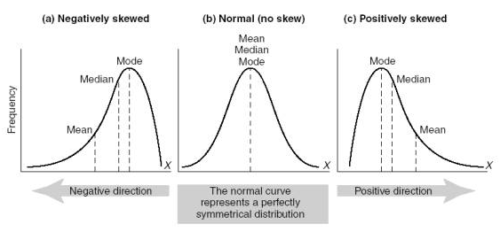
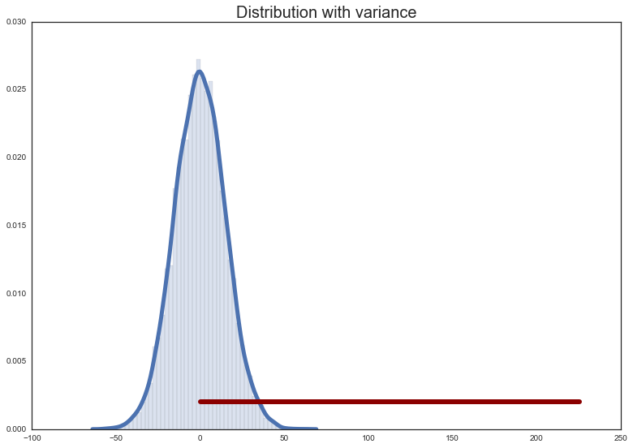
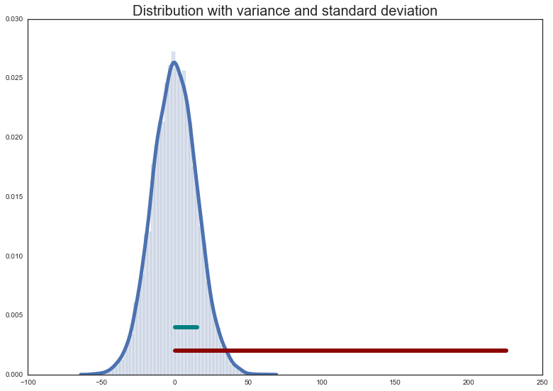

#  Math Primer 1 + Intro to NumPy
Week 1 | Lesson 3.3

### LEARNING OBJECTIVES
*After this lesson, you will be able to:*
- Understand the measures of Central Tendency (mean, median, and mode)
- Understand how mean, median and mode are affected by skewness in data
- Understand measures of variability (variance and standard deviation)


### STUDENT PRE-WORK
*Before this lesson, you should already be able to:*
- This should've been completed as pre-work before starting the course, but if you haven't
didn't watch it, please watch Lesson 3: Estimation
[Intro to Stats](https://www.udacity.com/course/intro-to-statistics--st101)


### LESSON GUIDE
| TIMING  | TYPE  | TOPIC  |
|:-:|---|---|
| 5 min  | [Introduction](#introduction)   |  Descriptive Statistics |
| 20 min  | [Demo / Guided Practice](#demo)  | Mean, Median, and Mode  |
| 20 min  | [Demo / Guided Practice](#demo)  | Skewness  |
| 20 min  | [Demo / Guided Practice](#demo)  | Range, Variance and Standard Deviation  |
| 20 min  | [Independent Practice](#ind-practice)  |   |
| 5 min  | [Conclusion](#conclusion)  |   |

---

<a name="Descriptive Statistics"></a>
## Introduction: Stats review  (5 mins)

There are two main fields of statistics: **descriptive** and **inferential**.

Right now, we're going to focus on descriptive statistics: describing, summarizing, and
understanding data.

Our focus today is on the **Measures of Central Tendency** Measures of Central Tendency provide descriptive information about the single numerical value that is considered to be the most typical of the values of a quantitative variable.

That may sound complicated, but you're probably already familiar with some measures of central tendency: the **mean**, **median**, and **mode**.
</br></br>

We'll also discuss **skewness**, which is the lack of symmetry in a distribution data that affects the mean, median, and mode.
</br></br>

Lastly we'll take a look at measures of variability, namely the **range**, **variance**, and **standard deviation**.
</br></br>


NumPy has functions to calculate all of these, but before we let NumPy do the work, it's important to understand the fundamental concepts.

[descriptive stats](http://www.southalabama.edu/coe/bset/johnson/lectures/lec15.htm)


<a name="Mean, median, and mode"></a>
## Guided Practice: Mean, median, and mode (20 mins)

##### Mean

_The mean is the sum of the numbers divided by the length of the list._

**Check:** Find the **mean** of this list using python:
```python
n = [1,2,3,4,5]
```

<details><summary> **calculate the mean**
</summary>
```python
n = [1,2,3,4,5]
n_mean = (1+2+3+4+5)/len(n)
```
</details>

---

##### Median

_For odd-length lists: the median is the middle number of the ordered list._

_For even-length lists: the median is the average of the two middle numbers of the ordered list._

**Check:** Find the **median** of each list using python:

```python
n_odd = [1,5,9,2,8,3,10,15,7]
n_even = [8,2,3,1,0,-1,-5,20]
```

<details><summary> **calculate the median**
</summary>
```python
n_odd = [1,5,9,2,8,3,10,15,7]
n_even = [8,2,3,1,0,-1,-5,20]

# STEP 1: Order the numbers:
n_odd = sorted(n_odd)

print(n_odd)
[1, 2, 3, 5, 7, 8, 9, 10, 15]

n_even = sorted(n_even)

print(n_even)
[-5, -1, 0, 1, 2, 3, 8, 20]

# STEP 2: Find the middle

# for odd-numbered lists of numbers:
n_odd_len_half = len(n_odd)/2.

print(n_odd_len_half)
4.5

odd_median = n_odd[int(n_odd_len_half - 0.5)]

print(odd_median)
7

# for even-numbered lists of numbers:
n_even_len_half = len(n_even)/2

print(n_even_len_half)
4

even_median = (n_even[n_even_len_half-1] + n_even[n_even_len_half]) / 2.

print(even_median)
1.5
```
</details>

---

##### Mode

_The mode is the most frequently occurring number._

Finding the mode is not as trivial as the mean or median, so here it is calculated using scipy.stats.mode().

Note: doing this without scipy.stats.mode() is a challenge problem in the independent practice section.

```python
from scipy.stats import mode

n = [0,1,1,2,2,2,2,3,3,4,4,4,5]

n_mode = mode(n)

# mode() returns an object with the array of mode(s) and the count(s):
print(n_mode)
ModeResult(mode=array([2]), count=array([4]))

print(n_mode.mode[0])
2

```

> Additional information here:
> [descriptive stats](http://www.southalabama.edu/coe/bset/johnson/lectures/lec15.htm)

---

##### Let numpy and scipy do the work

Luckily numpy and scipy come with convenience functions to calculate these values for you.

```python
from numpy import mean, median
from scipy.stats import mode

n = [3, 75, 98, 2, 10, 3, 14, 99, 44, 25, 31, 100, 356, 4, 23, 55, 327, 64, 6, 20]

print(mean(n))
67.950000000000003

print(median(n))
28.0

print(mode(n))
ModeResult(mode=array([3]), count=array([2]))
```

**Check:** Explain the output of the mode() function.

<a name="Skewness"></a>
## Guided Practice: Skewness (20 mins)

**Skewness** is lack of symmetry in a distribution of data.

[Technical note: we will be talking about skewness here in the context of _unimodal_ distributions.]



A **positive-skewed** distribution means the right side tail of the distribution is longer or fatter than the left.

Likewise a **negative-skewed** distribution means the left side tail is longer or fatter than the right.

Symmetric distributions have no skewness!

---

##### Skewness and measures of central tendency

The mean, median, and mode are affected by skewness.

When a distribution is symmetrical, the mean, median, and mode are the same number.

When a distribution is negatively skewed, the mean is less than the median, which is less than the mode.

**Negative skew: mean < median < mode**

When a distribution is positively skewed, the mean is greater than the median, which is greater than the mode!

**Positive skew: mode < median < mean**

This way of thinking can help you, especially if you can't see a line graph of the data. All you need are the mean and the median. Nice!

1. If the mean < median, the data are skewed left.
2. If the mean > median, the data are skewed right.

**Check:** Using this information, does the list of numbers form a symmetric distribution? Is it skewed left of right?


<a name="Range, Variance and Standard Deviation"></a>
## Guided Practice: Range, Variance and Standard Deviation (20 mins)

Measures of variability like the **range**, **variance**, and **standard deviation** tell you about the spread of your data.

These measurements give complementary (and no less important!) information to the measures of central tendency (mean, median, mode).

---

##### Range

The **range** is the difference between the lowest and highest values of a distribution.


<details><summary> **calculate the range**
</summary>
```python
n = [3, 75, 98, 2, 10, 3, 14, 99, 44, 25, 31, 100, 356, 4, 23, 55, 327, 64, 6, 20]

# In pure python:
n = sorted(n)
n_range = n[len(n) - 1] - n[0]

print(n_range)
354

# With numpy:
n_range = np.ptp(n)

print(n_range)
354
```
</details>

---

##### Variance

The **variance** is a numeric value used to describe how widely the numbers distribution vary.

In python variance can be calculated with:
```python
variance = []
n_mean = np.mean(n)

for n_ in n:
  variance.append((n_ - n_mean) ** 2)

variance = np.sum(variance)
variance = variance / len(n)
```

Which is **the average of the sum of the squared distances of each number from the mean of the numbers.**



**Check:** What could a distribution with a large variance look like? A small?

**Check:** What does a variance of 0 mean?

Using numpy the variance is simply:
```python
variance = np.var(n)

print(variance)
9414.6475
```

---

##### Standard deviation

The **standard deviation** is the square root of the variance.

Because the variance is the average of the distances from the mean _squared_, the standard deviation tells us approximately, on average, the distance of numbers in a distribution from the mean.

The standard deviation can be calculated with:
```python
std = np.std(n)

print(std)
97.029106457804716
```



**Check:** Is this the same as the average of the absolute deviations from the mean? If not, what is the difference between the measures?


<a name="ind-practice"></a>
## Independent Practice: Topic (20 minutes)

- With the provided data, determine the mean, median, and mode.
- Is the data skewed left or right? How do you know?
- Find the range, variance and standard deviation of your data set. What does the standard deviation tell you about the distribution?
- Challenge: calculate the mode without using scipy!

<a name="conclusion"></a>
## Conclusion (5 mins)

- Review & recap
- Q & A
