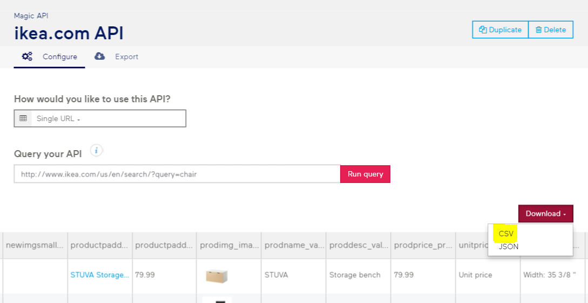
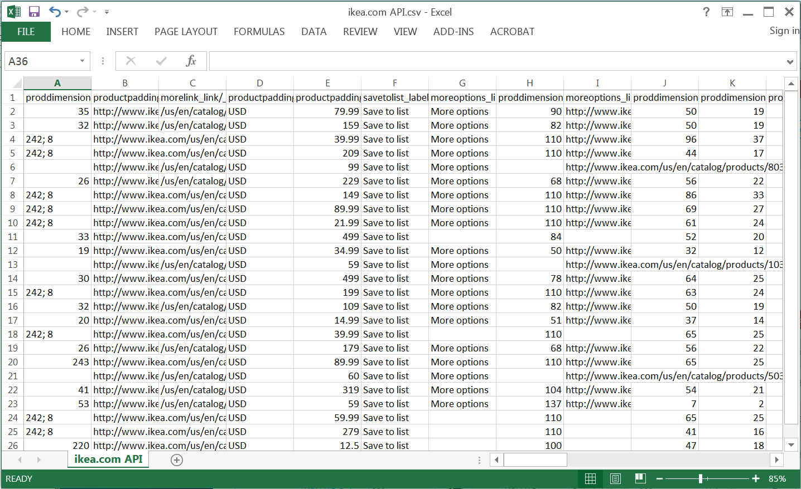

#  Web Scraping 101
Week 4 | Lesson 1.2

### LEARNING OBJECTIVES
*After this lesson, you will be able to:*
- Describe how web scraping works, conceptually
- Explain how to Web Scraping works using python
- Define how to approach scraping project data


### STUDENT PRE-WORK
*Before this lesson, you should already be able to:*
- Separate data into features and target
- Describe kNN classification
- Build and interpret a confusion matrix

### INSTRUCTOR PREP
*Before this lesson, instructors will need to:*
- Modify Demo Notebook w additional code snippets
- Plan for web scraping examples with BeautifulSoup, Mechanize, Import.io

### LESSON GUIDE
| TIMING  | TYPE  | TOPIC  |
|:-:|---|---|
| 5 min  | [Opening](#opening) | Overview of web scraping |
| 10 min  | [Introduction](#introduction)   | Web scraping discussion |
| 10 min  | [Demo](#demo1)  | Python Library BeautifulSoup |
| 10 min  | [Demo](#demo2)  | Python Library Mechanize |
| 10 min  | [Demo](#demo2)  | Web Based Tool - Import.io |
| 20 min  | [Guided Practice](#guided-practice)  | Import.io |
| 20 min  | [Independent Practice](#ind-practice)  | Import.io  |
| 5 min  | [Conclusion](#conclusion)  |  Tool Comparison Discussion |

---

<a name="opening"></a>
## Opening (5 mins)
- Review pre-work, projects, or exit ticket, if applicable
- Review current lesson objectives

> **Check:** Ask students to define, explain, or recall any **general** prior concepts or tools.

<a name="introduction"></a>
## Introduction: Web Scraping! (5 mins)

Web scraping is a technique of extracting information from websites. You can use web scraping to focus on transforming *unstructured data* from the web into *structured data* that can be stored and analyzed. Web pages contain a wealth of information (in text form), designed mostly for human consumption.

> Instructor Note: Take a pulse check on your student's background knowledge. If needed, take 5 minutes to review basic DOM principles. If more practice is needed, note range and plan for a quick morning exercise review session. Example materials are available from our FT and PT programming courses.

<a name="demo1"></a>
## Demo: BeautifulSoup (10 mins)

One really popular tool for web scraping is the Python library [BeautifulSoup](https://pypi.python.org/pypi/beautifulsoup4). This library allows you to read a webpage and scan for HTML strings that are of interest in order to scrape certain values.

In this example, we can use BeautifulSoup to scrape `date` and `sunrise times`:

```python
import urllib2
from BeautifulSoup import BeautifulSoup
# or if you're using BeautifulSoup4:
# from bs4 import BeautifulSoup

soup = BeautifulSoup(urllib2.urlopen('http://www.timeanddate.com/worldclock/astronomy.html?n=78').read())
for row in soup('table', {'class' : 'spad'})[0].tbody('tr'):
tds = row('td')
print tds[0].string, tds[1].string

# will print date and sunrise
```

> Note: If needed, review and test out BeautifulSoup on a few more examples.


<a name="demo2"></a>
## Demo: Web Scraping - Mechanize (10 mins)

[Mechanize](http://wwwsearch.sourceforge.net/mechanize/) is another library that allows you to read a webpage and scan for HTML strings that are of interest to scrap certain values. In this example, it scrapes news headlines and prints them every half an hour. You can easily make this script output headlines to a file that can be analyzed later.


```python
import mechanize
import cookielib
import lxml.html as lh
import time  

br = mechanize.Browser()
cj = cookielib.LWPCookieJar()
br.set_cookiejar(cj)
br.set_handle_equiv(True)
br.set_handle_gzip(True)
br.set_handle_redirect(True)
br.set_handle_referer(True)
br.set_handle_robots(False)
br.set_handle_refresh(mechanize._http.HTTPRefreshProcessor(), max_time=1)
br.addheaders = [('User-agent', 'Mozilla/5.0 (X11; U; Linux i686; en-US; rv:1.9.0.1) Gecko/2008071615 Fedora/3.0.1-1.fc9 Firefox/3.0.1')]

while True:
    r = br.open('https://news.google.com/')
    html = r.read()
    doc=lh.fromstring(html)
    for i in doc.xpath('.//*[@class="esc-lead-article-title"]'):
        print i.text_content()
    time.sleep(1800)

end
```

<a name="demo3"></a>
## Demo: Web Scraping - Import.io (10 mins)

In this lesson we will be looking at a popular basic data extraction technique that can be used to extract data from webpages, called [Import.io](http://www.import.io). Import.io is a web-based data extraction platform. Using import.io you can turn any website into a spreadsheet or an API in few minutes, without needing to write any code.

There is a lot of data on the web, however some of this data is confined inside a webpage in certain formats, getting this data can be challenging without the right tools.

When working with information coming from web pages, data scientists notice there are far more pieces of information than just text. Shopping websites contain prices, hotel booking sites contain dates, and there are many images on the web.

An API is one way to get that data, however that is not always available, therefore, import.io allows data scientists to take advantage of all of these different data types when there is a need to extract data from web pages.

Data types are automatically cleaned and standardized to a data set, which means that import.io provides you with better data for a single data source that is consistent data between multiple sources.


**Check:**
- What are some of the important elements in web scraping?
- How do they relate?
- When might web scraping be useful? Why?

<a name="guided-practice"></a>
## Guided Practice: Import.io & Web Scraping (15 mins)

> Note: Open up web pages and demonstrate using import.io on a sample structured website like [Ikea](www.ikea.com)

Let’s say we would like to extract information on the items for sale on the IKEA website.

Import.io can extract the data via API using an API query as shown below. This page allows for the adjustment of the API query so that 'chair' can be specified. What's cool about this tool is that you can immediately see the results of the API when the ‘Run query’ button is pressed!


Whenever you're happy with the results of your search, press ‘Download’ and pick the file format for your data. In this case, we'll select CSV:




The data can now be opened in a CSV file, ready for use with Pandas:




On your own, review the [Import.io documentation](www.import.io) and then practice scraping sample results from the [IKEA website](https://www.ikea.com) website.

> **Check**: Are students able to successfully scrape structured data? If so, ove onto the independent practice.


<a name="ind-practice"></a>
## Independent Practice: Scraping Sample Project 4 Data (20 minutes)

- Create an account on import.io, as needed
- Set up a new "magic" extractor for [USA Jobs](https://www.usajobs.gov) 
- Search for "data science" and review results
- Download results using [import.io](http://www.import.io)
- Load the downloaded csv file into python using pandas
- Examine and clean the dataset in pandas


<a name="conclusion"></a>
## Conclusion (5 mins)
- Review Web scraping techniques: BeautifulSoup, Mechanize, import.io
- Discuss: relative strengths and weaknesses of each approach.

**Check**: What **business cases** can you think of for these tools?

***


### ADDITIONAL RESOURCES

- [Import.io tutorial](http://importio.desk.com/customer/en/portal/topics/919168-building-an-extractor/articles?b_id=12993)
- [Mechanize & Python](http://swizec.com/blog/scraping-with-mechanize-and-beautifulsoup/swizec/5039)
- [Mechanize documentation](http://www.pythonforbeginners.com/mechanize/browsing-in-python-with-mechanize/)
- [Beautiful Soup tutorial](https://www.crummy.com/software/BeautifulSoup/bs3/download/2.x/documentation.html)
- [Import.io has an API](https://import.io/data/mine/?id=37bbe05d-c52d-4e01-85c1-b0ef67e74f0f)
