#  Introduction to Logistic Regression
Week 4 | Lesson 2.1

### LEARNING OBJECTIVES
*After this lesson, you will be able to:*
- Define logistic regression
- Explain the math behind logistic regression
- Build logistic regression models using statsmodels


### STUDENT PRE-WORK
*Before this lesson, you should already be able to:*
- Review a linear regression model (LinearRegression) in statsmodels
- Experience with `patsy` and/or formula syntax for building dummy variables or design matrices
- Interpret linear model coefficients
- Recall metrics for accuracy and misclassification
- Understand odds and odds ratios, and contrast to probability


### INSTRUCTOR PREP
*Before this lesson, instructors will need to:*
- Send math and additional resources on odds and logit models for read-ahead
- Complete prep work

### LESSON GUIDE
| TIMING  | TYPE  | TOPIC  |
|:-:|---|---|
| 5 min  | [Opening](#opening)  | Discussion  |
| 25 min  | [Introduction](#introduction)   | Introduction to Logistic Regression |
| 50 min  | [Guided Practice](#guided-practice)  |  The math behind Logistic Regression |
| 5 min  | [Conclusion](#conclusion)  | Review/Recap  |

---

<a name="opening"></a>
## Opening (5 mins)

> Review objectives and prior materials.

<a name="introduction"></a>
## Introduction: Logistic Regression  (25 mins)

Logistic Regression is a linear approach to solving a classification problem. That is, we can use a linear model, similar to Linear Regression, in order so solve if an item belongs or does not belong to a class label.


## What is Logistic Regression? A *Short* Definition

Logistic regression measures the relationship between the dependent data point variables and one or more independent data points by estimating probabilities.

The goal of logistic regression is we are predicting the likelihood (probability) that Y is equal to 1 (rather than 0) given certain values of X. That is, if X and Y have a positive linear relationship, the probability that a person will have a score of Y = 1 will increase as values of X increase. Our model's goal is predicting probabilities - rather than target scores - with our independent variables.

For example, we might try to predict whether or not small businesses will succeed or fail based on the number of years of experience the owner has in the field prior to starting the business. We presume that those people who have been selling widgets for many years who open their own widget business will be more likely to succeed.

That means that as X (the number of years of experience) increases, the probability that Y will be equal to 1 (success in the new widget business) will tend to increase. If we take a hypothetical example, in which there were 50 small businesses studied and the owners have a range of years of experience from 0 to 20 years, we could represent this tendency to increase the probability that Y=1 with a graph.

To illustrate this, it is convenient to break years of experience up into categories (i.e., 0-4, 5-8, 9-12, 13-16, 17-20), but logistic regression does not require this.

If we compute the mean score on Y (averaging the 0s and 1s) for each category of years of experience, we will get something like:

Yrs Exp Average Probability that Y=1
0-4 .17 .17
5-8 .40 .40
9-12 .50 .50
13-16 .56 .56
17-20 .96 .96

If we graph this, it looks like the following:

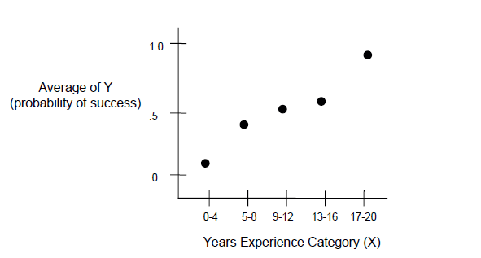

Notice an S-shaped (sigmoid) curve. This is typical when we are plotting the average (or expected) values of Y by different values of X whenever there is a positive association between X and Y. As X increases, the probability that Y=1 increases. In other words, when the owner has more years of experience, a larger percentage of businesses in that category succeed

### Intuition Behind Logistic Regression

The intuition behind logistic regression is to transform the output of a linear regression which has a wider range, to a range that probability lies in. The transformation formula is Logit that maps a value to a number in the range (0,1). Note, this is not the inclusive set [0,1]; in practice, probability of something or NOT something cannot be 1 or 0, and the odds formula used in logistic regression makes the sigmoid function asymptotic to 0 and 1, but not touching.

For more on why odds and probability practically cannot be absolute, see: http://lesswrong.com/lw/mp/0_and_1_are_not_probabilities/

## *Some* of the Math behind Logistic Regression

Logistic regression is only appropriate when the dependent variable is binary; for example, when something can be coded as` 0` or `1`

##### Intercept and coefficients

To review, the intercept and coefficients are symbolized as such:

<a href="url"></a><br>

<a href="url">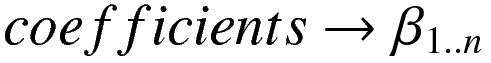</a><br><br>

##### Review of the linear regression equation

In linear regression, the expected value or mean of Y (the dependent variable) is a sum of the predictors multiplied by their beta coefficients, plus the intercept.

<a href="url">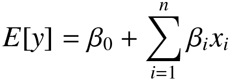</a><br><br><br><br>

However, when Y is a binary valued variable this is no longer appropriate since this can predict values outside of the range (0, 1).

##### Binary expected value and odds ratios

When Y is binary, the expected value of Y is equivalent to the probability that Y equals 1.

<a href="url">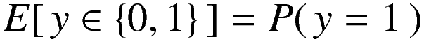</a><br><br>

Probabilities can also be expressed as **odds ratios**, which is simply the probability of one event or category divided by 1 - that probability.

<a href="url">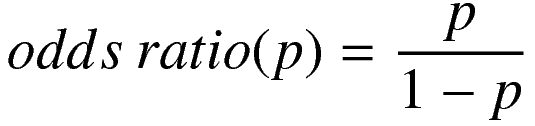</a><br><br><br>

The possible range of values for any odds ratio is 0 to infinity.

<a href="url">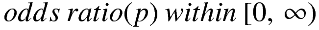</a><br><br>

##### Modifying regression with odds ratios

We can take the natural logarithm of the odds ratio to put the possible values in the range from negative infinity to positive infinity.

<a href="url">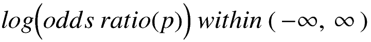</a><br><br>

This is convenient since we now have the same possible range of values for the binary dependent variable (now expressed as the natural logarithm of an odds ratio) as the standard linear regression.

This kind of conversion of the expected value of the dependent variable is also expressed as what is known as a **link function** and is the basis for generalized linear models, or GLMs.

We wrap the expected value of the dependent variable in the link function, here canonically denoted with "g".

<a href="url">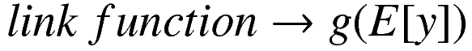</a><br><br>

Which is still a linear relationship with the predictors.

<a href="url">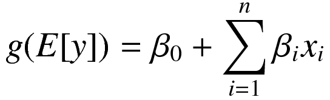</a><br><br><br><br>

Next we can invert the link function to solve for the expected value of the dependent variable, which as you recall is the log odds of Y = 1.

<a href="url">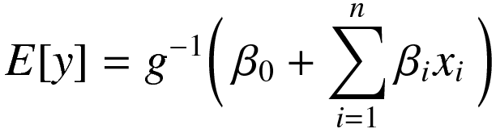</a><br><br><br><br>

And then more explicitly solve this.

<a href="url"></a><br><br><br><br>

<a href="url">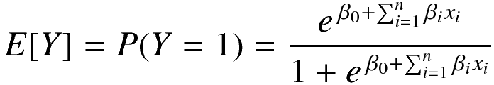</a><br><br><br><br>

Obviously I skipped some math steps there, but this is the equation representing the conversion of your coefficients and predictors into the probability that Y = 1!

This allows us to solve the regression allowing the beta coefficients to have any value, but guarantees that the predicted value for Y will be a probability that falls within the range 0 to 1.


## Recap & Review

Check: What is Logistic regression?

> A: A statistical method for analyzing a dataset in which there are one or more independent variables that determine an outcome. The outcome is measured with a variable (in which there are only two possible outcomes).

Check: What is important about the dependent variable for logistic regression?

> A: The dependent variable is binary, i.e. it only contains data coded as 1 (TRUE, success, pregnant, etc. ) or 0 (FALSE, failure, non-pregnant, etc.).

#### Goals of Logistic Regression

The goal of logistic regression is to find the best fitting model to describe the relationship between the characteristic of interest (dependent variable = response or outcome variable) and a set of independent (predictor or explanatory) variables. Logistic regression generates the coefficients (and its standard errors and significance levels) of a formula to predict a logit transformation of the probability of presence of the characteristic of interest:

# 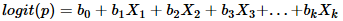

where p is the probability of presence of the characteristic of interest. The logit transformation is defined as the logged odds:

# 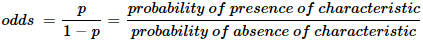

and

# 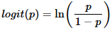

Logistic Regression is quite simple. Specify the column containing the variable you're trying to predict followed by the columns that the model should use to make the prediction.

We will use a dataset of chemical properties of wines to predict those that are high quality or not.

<a name="guided-practice"></a>
## Guided Practice: Topic (50 mins)

Use the following Python code to demonstrate Logistic Regression.  We will utilize the formula syntax of `statsmodels` (through `patsy`) to automatically create dummy columns

```python
import statsmodels.formula.api as sm
import pandas as pd


df = pd.read_csv("https://s3.amazonaws.com/demo-datasets/wine.csv")

model = sm.logit(
    "high_quality ~ residual_sugar + pH + alcohol",
    data = df
).fit()

model.summary()
```

**Check: Understanding of dummy variables and summary table.**

Let's check out the [Starter Code](./code/starter-code/starter-code.ipynb):

> [Solution Code](./code/solution-code/solution-code.ipynb):

<a name="conclusion"></a>
## Conclusion (5 mins)
- Logistic regression is a classification algorithm with similar properties as linear regression
- It is very fast and efficient and by-far the most common classification algorithm
- The coefficients in a logistic regression model represent the change in log-odds due to the input variables

### ADDITIONAL RESOURCES
- [Logistic Regression Video Walkthrough](https://www.youtube.com/watch?v=zAULhNrnuL4&noredirect=1)
- [Logistic Regression Walkthrough](http://www.mc.vanderbilt.edu/gcrc/workshop_files/2004-11-12.pdf)
- [Logistic Regression w/ Statsmodel - Well Switching in Bangledesh](http://nbviewer.ipython.org/urls/raw.github.com/carljv/Will_it_Python/master/ARM/ch5/arsenic_wells_switching.ipynb)
- [Odds Ratio Explanation](http://www.wright.edu/~thaddeus.tarpey/ES714glm.pdf)
