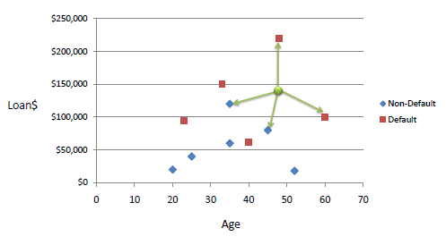
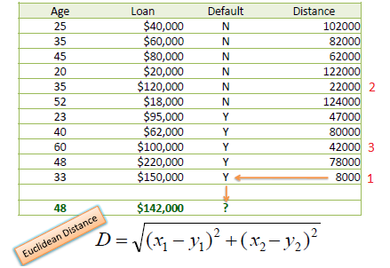

#  Intro to Classification
Week 4 | Lesson 1.1


### LEARNING OBJECTIVES
*After this lesson, you will be able to:*
- Define and give examples of classification
- Explain kNN algorithm
- Build a K-Nearest Neighbors model


### STUDENT PRE-WORK
*Before this lesson, you should already be able to:*
- Run Python on your laptop
- Have Basic understanding of the key concepts of Python programming


### LESSON GUIDE
| TIMING  | TYPE  | TOPIC  |
|:-:|---|---|
| 5 min  | [Opening](#opening)  | Discuss lesson objectives |
| 10 min  | [Introduction](#introduction)   | Description of Classification  |
| 20 min  | [Demo](#demo)  | How kNN logically works   |
| 50 min  | [Independent Practice](#ind-practice)  |  Build a simple kNN model  |
| 5 min  | [Conclusion](#conclusion)  | Review / Recap |

---

<a name="opening"></a>
## Opening (5 mins)

We've been doing regression, which is predicting to a continuous value. Now let's learn some techniques for classification: predicting to class values.

> Check: what is a scenario where you would use classification? Can you convert a regression problem into a classification one?


<a name="introduction"></a>
## Introduction: Topic (10 mins)

Classification is a technique in machine learning of assigning a classification on new instances of data from already observed past data whose classification is known. 

For example, we might build a machine learning model to detect spam emails. By analyzing the content of emails and ‘classify’ them as either spam or legitimate emails. Another example, we might have a number of species of flowers and would like to know what specie of flower is from a dataset of known flowers.

Classification is a machine learning problem for solving a set value given the knowledge we have about that value. Many classification problems boil down to a binary problem. Many problems don't appear to be binary at first glance, but with a limited set of variables, you can usually boil your model down to a boolean value. For instance, what if you are predicting whether an image pixel will be red or blue? In analyzing the image, we could check whether a pixel "is red" or "is not red." Binary classification is the simplest form of classification, though classification problems can certainly be wrapped around multiple class labels.

There are a number of different classification techniques, including kNN (k-Nearest Neighbors).

#### K-Nearest Neighbors (kNN)

K-Nearest Neighbors (kNN) classification algorithm is one of the simplest to perform and comprehend. It is based on proximity to known data points with known classifications. It is surprisingly powerful and can learn complex decision boundaries.

A case is classified by a majority vote of its neighbors, with the case being assigned to the class most common amongst its K nearest neighbors measured by a distance function. If K = 1, then the case is simply assigned to the class of its nearest neighbor.

Choosing the optimal value for K is best done by first inspecting the data. In general, a large K value is more precise as it reduces the overall noise, but there is no guarantee. Cross-validation is another way to retrospectively determine a good K value by using an independent dataset to validate the K value. Historically, the optimal K for most datasets has been between 3-10. That produces much better results than 1NN.

<a name="demo"></a>
## Demo: How kNN logically works (20 mins)

Here is some pseudo-code to demonstrate how kNN logically works:

```python
procedure KNN(x)
  begin
    looping through all known data points in training data, find the closest k points to x
    assign f(x) = majority classification among the k closest points
  end
```

Consider the following data concerning credit default. Age and Loan are two numerical variables (predictors) and Default is the target.




We can now use the training set to classify an unknown case (Age=48 and Loan=$142,000) using Euclidean distance. If K=1 then the nearest neighbor is the last case in the training set with Default=Y.




With K=3, there are two Default=Y and one Default=N out of three closest neighbors. The prediction for the unknown case is again Default=Y.

> Check: there is something very problematic about our distance calculations: do you see it?


<a name="ind-practice"></a>
## Independent Practice: Build a simple kNN model  (50 minutes)

In teams, use the structure in the lesson notebook to build out a kNN classifier.

<a name="conclusion"></a>
## Conclusion (5 mins)
- What are class labels? What does it mean to classify?
- How does the kNN algorithm work?
- How do you define: accuracy, misclassification?

***

### ADDITIONAL RESOURCES

- [How KNN Works](https://saravananthirumuruganathan.wordpress.com/2010/05/17/a-detailed-introduction-to-k-nearest-neighbor-knn-algorithm/)
