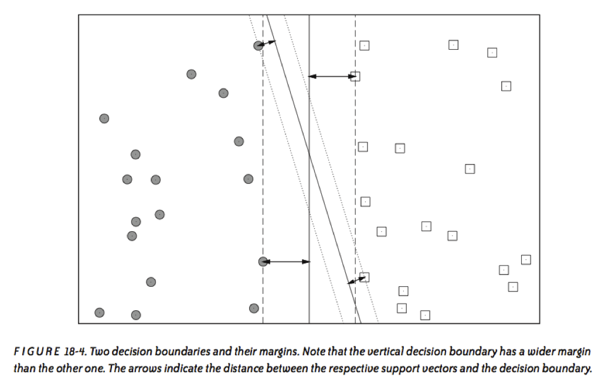
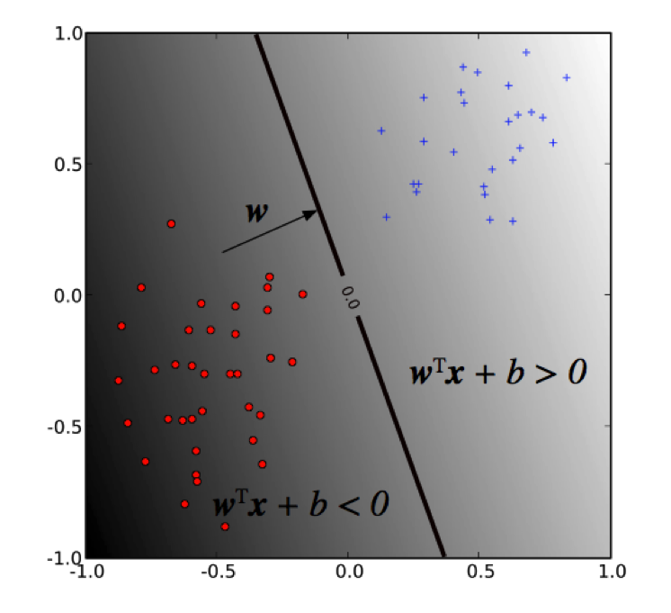
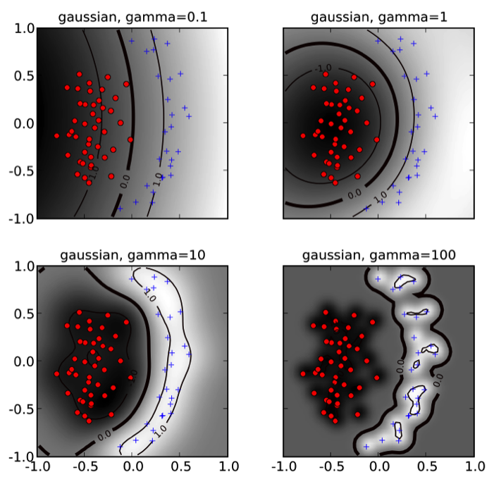

#  Support Vector Machines
Week 5 | Lesson 5.1

> Note: This lesson is a bonus/optional component for Week 5. Feel free to swap this out for additional review & project work as needed.

### LEARNING OBJECTIVES
*After this lesson, you will be able to:*
- Describe what a Support Vector Machine (SVM) model is
- Explain the math that powers it
- Evaluate pros/cons compared to other models
- Know how to tune it

### STUDENT PRE-WORK
*Before this lesson, you should already be able to:*
- Perform regression
- Perform regularization

### INSTRUCTOR PREP
*Before this lesson, instructors will need to:*
- Read in / Review any dataset(s) & starter/solution code
- Generate a brief slide deck
- Prepare any specific materials
- Provide students with additional resources

### LESSON GUIDE
| TIMING  | TYPE  | TOPIC  |
|:-:|---|---|
| 5 mins | [Opening](#opening) | Opening |
| 45 mins | [Introduction](#introduction) | Introduction: Support Vector Machines |
| 10 mins | [Demo](#demo) | Demo: Linear SVM |
| 20 mins | [Guided-practice](#guided-practice) | Guided Practice: Tuning an SVM |
| 5 mins | [Conclusion](#conclusion) | Conclusion |
<a name="opening"></a>
## Opening (5 mins)

Today we will learn about Support Vector Machines.

**Check:** What do you think the name means?

<a name="introduction"></a>
## Introduction: Support Vector Machines (45 mins)

A *support vector machine* (SVM) is a binary linear classifier whose decision boundary is explicitly constructed to minimize generalization error.

Recall:
- Binary classifier – solves two-class problem
- Linear classifier – creates linear decision boundary (in 2d)


The decision boundary is derived using geometric reasoning (as opposed to the algebraic reasoning we’ve used to derive other classifiers). The generalization error is equated with the geometric concept of margin, which is the region along the decision boundary that is free of data points.



The goal of an SVM is to create the linear decision boundary with the largest margin. This is commonly called the _maximum margin hyperplane_ (MMH).

Nonlinear applications of SVM rely on an implicit (nonlinear) mapping that sends vectors from the original feature space K into a higher-dimensional feature space K’. Nonlinear classification in K is then obtained by creating a linear decision boundary in K’. In practice, this involves no computations in the higher dimensional space, thanks to what is called the _kernel trick_.

### Decision Boundary

The decision boundary (MMH) is derived by the discriminant function:

$$
f(x) = w^T x + b
$$

where `w` is the weight vector and `b` is the bias. The sign of `f(x)` determines the (binary) class label of a record `x`.





As we said before, SVM solves for the decision boundary that minimizes generalization error, or equivalently, that has the maximum margin. These are equivalent since using the MMH as the decision boundary minimizes the probability that a small perturbation in the position of a point produces a classification error.

Selecting the `MMH` is a straightforward exercise in analytic geometry (we won’t go through the details here). In particular, this task reduces to the optimization of the following convex objective function:


$$\text{minimize:  } \space \frac{1}{2}||w||^2$$
$$\text{subject to:  } y_i(w^T x_i + b) \geq 1 \text{  for  } i = 1,..,N$$

Notice that the margin depends only on a subset of the training data; namely, those points that are nearest to the decision boundary.

These points are called the _support vectors_. The other points (far from the decision boundary) don’t affect the construction of the `MMH` at all.


This formulation only works if the two classes are linearly separable, so that we can indeed find a margin to separate them. Usually however, classes are not separable, and there is partial overlap between them. This requires an extension of the formulation to accommodate for class overlap.

### Soft margin, slack variables

Class overlap is achieved by relaxing the minimization problem or softening the margin. This amounts to solving the following problem:


$$ \text{minimize:  } \space \frac{1}{2}||w||^2 + C \sum_{i=1}^N \xi_i $$
$$ \text{subject to:  } y_i(w^T x_i + b) \geq 1 - \xi_j \text{  for  } i = 1,..,N \text{  and  } \xi_i > 0 $$

The hyper-parameter `C` (soft-margin constant) controls the overall complexity by specifying penalty for training error. This is yet another example of *regularization*.


### Nonlinear SVM

The soft-margin optimization problem can be rewritten as:

$$ \text{maximize:  } \sum_{i=1}^N \alpha_i
   - \frac{1}{2}\sum_{i=1}^N\sum_{j=1}^N y_i y_j \alpha_i \alpha_j x^Tx$$
$$ \text{subject to:  } \sum_{i=1} y_i \alpha_i = 0, 0 \leq \alpha_i \leq C $$

Since the feature vector $x$ only appears in the inner product, we can replace this inner product with a more general function that has the same type of output as the inner product. This is called _kernel trick_.

Formally, we can think of the inner product as a map that sends two vectors in the feature space K into the real line $R$. A kernel function is a non-linear map the sends two vectors in a higher-dimensional feature space K’ into the real line $R$.

See [here](http://www.cs.columbia.edu/~kathy/cs4701/documents/jason_svm_tutorial.pdf) for a deeper tutorial on the math.


#### Some popular kernels

- Linear kernel: $ k(x, x') = x^T x' $
- Polynomial kernel: $ k(x, x') = (x^T x' + 1)^d$
- Gaussian kernel (rbf): $ k(x, x') = \exp{(-\gamma||x - x'||^2)} $

The hyperparameters $d$ and $\gamma$ affect the flexibility of the decision boundary.





<a name="demo"></a>
## Demo: Linear SVM (10 mins)

Scikit-learn implements support vector machine models in the `svm` package.


```python
import pandas as pd
import numpy as np
from sklearn.svm import SVC
from sklearn.datasets import load_iris

iris = load_iris()

X = iris.data
y = iris.target
```


```python
model = SVC(kernel='linear')
model.fit(X, y)
```


    SVC(C=1.0, cache_size=200, class_weight=None, coef0=0.0,
      decision_function_shape=None, degree=3, gamma='auto', kernel='linear',
      max_iter=-1, probability=False, random_state=None, shrinking=True,
      tol=0.001, verbose=False)


Notice that the SVC class has several parameters. In particular we are concerned with two:

- `C`: penalty parameter of the error term (regularization)
- `kernel`: the type of kernel used (`linear`, `poly`, `rbf`, `sigmoid`, `precomputed` or a callable.)

Notes from the documentation:
- In the current implementation the fit time complexity is more than quadratic with the number of samples which makes it hard to scale to dataset with more than a couple of 10000 samples.
- The multi-class support is handled according to a one-vs-one scheme.

As usual we can calculate the cross validated score to judge the quality of the model.


```python
from sklearn.cross_validation import cross_val_score

cvscores = cross_val_score(model, X, y, cv = 5, n_jobs=-1)
print "CV score: {:.3} +/- {:.3}".format(cvscores.mean(), cvscores.std())
```

    CV score: 0.98 +/- 0.0163


<a name="guided-practice"></a>
## Guided Practice: Tuning an SVM (20 minutes)

An SVM almost never works without tuning its parameter.

**Check:** Try performing a grid search over kernel type and regularization strength to find the optimal score for the above data.

>Answer:
```python
from sklearn.grid_search import GridSearchCV
parameters = {'kernel':('linear', 'rbf'), 'C':[0.1, 1, 3, 10]}
clf = GridSearchCV(model, parameters, n_jobs=-1)
clf.fit(X, y)
clf.best_estimator_
```

**Check:** Can you think of pros and cons for Support Vector Machines

> Pros:
- Very powerful, good performance
- Can be used for anomaly detection (one-class SVM)

> Cons:
- Can get very hard to train with lots of data
- Prone to overfit (need regularization)
- Black box

<a name="conclusion"></a>
## Conclusion (5 mins)

In this class we have learned about Support Vector Machines. We've seen how they are powerful in many situations and what can some of their limitations be.

Can you think of a way to apply them in business?

### ADDITIONAL RESOURCES

- [Scikit Learn Documentation](http://scikit-learn.org/stable/modules/svm.html)
- [Scikit Learn Example 1](http://scikit-learn.org/stable/auto_examples/svm/plot_iris.html#example-svm-plot-iris-py)
- [Scikit Learn Example 2](http://scikit-learn.org/stable/auto_examples/svm/plot_separating_hyperplane.html#example-svm-plot-separating-hyperplane-py)
- [A user's guide to SVM](http://pyml.sourceforge.net/doc/howto.pdf)
- [Support Vector Machines as probabilistic models](http://www.icml-2011.org/papers/386_icmlpaper.pdf)
